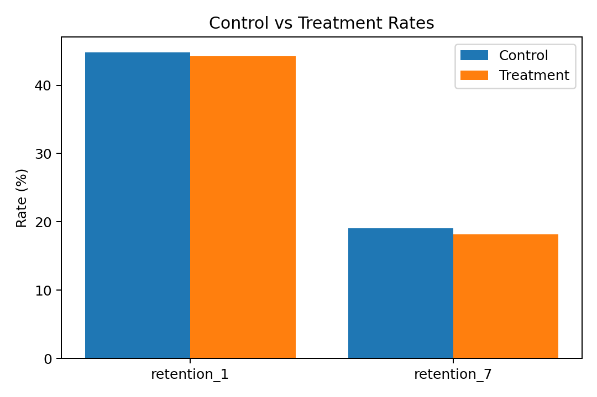

# AB-Experimentation GTM Playbook

Data-driven A/B testing playbook for Go-to-Market decisions.
It ingests a public experiment dataset, runs statistical tests (two-proportion z-tests, confidence intervals, effect sizes), estimates **power** and **MDE**, and exports a stakeholder-ready Excel workbook plus a quick visual preview.

> **Skills showcased:** SQL-first thinking, Python for statistical rigor, experiment design, power/MDE, executive storytelling, reproducibility.

---

## What’s inside
- **Notebook:** [`notebooks/01_ingest_eda.ipynb`](notebooks/01_ingest_eda.ipynb)  
- **Sample Excel report:** [`notebooks/reports/ab_results_cookie_cats.xlsx`](notebooks/reports/ab_results_cookie_cats.xlsx)  
- **Preview chart:**  
  

---

## Dataset context

**Cookie Cats** is a mobile puzzle game that uses “gates” to block progress. This public A/B test moved the first gate from **level 30** (control: `gate_30`) to **level 40** (treatment: `gate_40`). The CSV tracks whether players came back **Day-1** and **Day-7** after install.

**Columns**
- `userid` — anonymous player ID (one row per user)
- `version` — `gate_30` (control) or `gate_40` (treatment)
- `sum_gamerounds` — total rounds played (engagement proxy)
- `retention_1` — 0/1, returned the next day (D1)
- `retention_7` — 0/1, returned seven days later (D7)

---

## Executive summary (from this run)
- **Day-1 retention:** Control = **44.82%**, Treatment = **44.23%** → **Δ = −0.59 pp**, **Lift = −1.32%**, **p = 0.0744**, **Significant @5%: No**  
- **Day-7 retention:** Control = **19.02%**, Treatment = **18.20%** → **Δ = −0.82 pp**, **Lift = −4.31%**, **p = 0.0016**, **Significant @5%: Yes**

**Recommendation:** Treatment underperforms on Day-7 retention with statistical significance. Keep **Control** as default, investigate the gating strategy behind Treatment, and consider a follow-up test with tighter success criteria. Day-1 shows no significant difference.

---

## Why this matters (GTM & Strategy roles)
- Turns raw experiment data into **clear investment recommendations** (lift, significance, uncertainty).
- Quantifies **tradeoffs** with **Minimum Detectable Effect** at 80% power.
- Produces **executive-ready artifacts** (Excel with formatted tables and charts) that non-technical stakeholders can use.

---

## Methods
- **Primary tests:** Two-proportion **z-tests** (two-sided), pooled SE under H0.  
- **Uncertainty:** 95% confidence intervals on absolute difference.  
- **Effect size:** **Cohen’s h** for proportions.  
- **Power & MDE:** Observed power at current sample sizes and **MDE** for 80% power (@ α = 0.05).  
- **Stratification sanity:** Optional cut by engagement deciles to check stability.

---

## Outputs
The notebook writes a formatted Excel workbook with:
- **Summary:** Control vs Treatment rates, absolute difference (pp), relative lift (%), p-value, Cohen’s h, significance flag, plus a bar chart.  
- **Power_MDE:** Observed power and MDE per metric.  
- **Variant Balance / Variant Metrics:** Sample balance and mean metrics by variant.  
- **Retention1 by Decile:** Sanity check across engagement deciles.

Open the sample: [`notebooks/reports/ab_results_cookie_cats.xlsx`](notebooks/reports/ab_results_cookie_cats.xlsx)

---

## Repository structure

data/                 # public CSV (auto-downloaded)
notebooks/
  └── 01_ingest_eda.ipynb
  └── reports/
      └── ab_results_cookie_cats.xlsx   # sample stakeholder workbook (committed for reviewers)
reports/              # optional alternative location for reports
src/                  # reserved for future helpers/modules
sql/                  # optional SQL validation (e.g., DuckDB)
assets/
  └── summary_chart.png                  # preview image for README
requirements.txt
README.md


---

## Interpretation guide
- **Absolute difference (pp)** is the most intuitive way to size impact; relative lift (%) helps compare across metrics with different baselines.
- **p-value < 0.05** indicates statistical evidence; always check confidence intervals to understand uncertainty.
- **Practical significance matters:** weigh impact vs. cost, UX tradeoffs, and operational constraints.
- **Power & MDE:** If observed power is low, increase sample size or test duration to reliably detect meaningful effects.
- **Validate assumptions:** randomization integrity, no SRM (sample ratio mismatch), and stability across key segments.

---

## Limitations
- Assumes independent users and proper randomization; external shocks (seasonality, promos) can bias results.
- Binary outcomes are modeled via two-proportion tests; for other metrics consider GLM/OLS or non-parametric tests.

---

## Reproducibility
```bash
# 1) Create and activate a virtual environment
python3 -m venv .venv
source .venv/bin/activate

# 2) Install dependencies
pip install -r requirements.txt

# 3) Run the notebook
jupyter notebook
# Open notebooks/01_ingest_eda.ipynb and Run All
