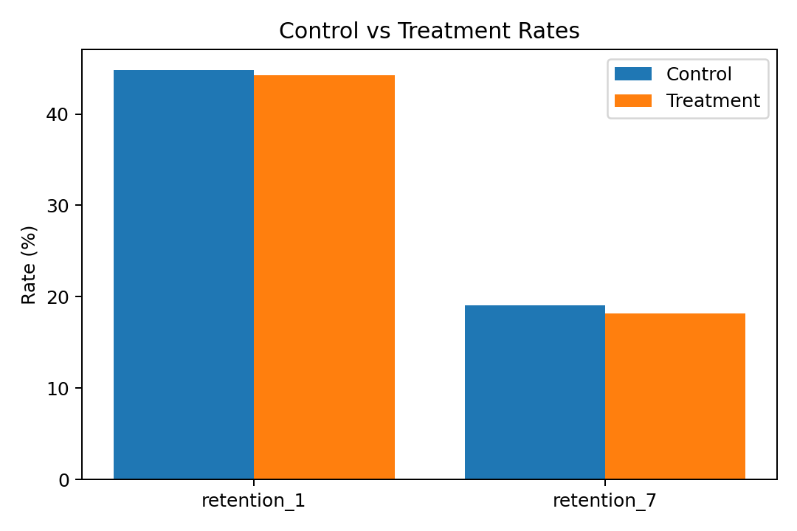

# AB-Experimentation GTM Playbook

Data-driven A/B testing playbook for Go-to-Market decisions.
It ingests a public experiment dataset, runs clean statistical analyses (two-proportion z-tests, confidence intervals, effect sizes),
estimates **power** and **MDE**, and exports a stakeholder-ready Excel workbook plus a quick visual preview.

> Skills showcased: SQL-first thinking, Python for statistical rigor, experiment design, power/MDE, executive storytelling, reproducibility.

## What’s inside
- **Notebook:** [notebooks/01_ingest_eda.ipynb](notebooks/01_ingest_eda.ipynb)
- **Sample Excel report:** [notebooks/reports/ab_results_cookie_cats.xlsx](notebooks/reports/ab_results_cookie_cats.xlsx)

### Preview


## Why this matters (GTM & Strategy roles)
- Turns raw experiment data into clear investment recommendations (lift, significance, uncertainty).
- Quantifies tradeoffs (Minimum Detectable Effect at 80% power).
- Produces executive-ready artifacts (Excel with formatted tables & charts) that non-technical stakeholders can use.

## Dataset
- Source: Cookie Cats A/B test (public). Binary outcomes for Day-1 and Day-7 retention by variant.
- The notebook auto-downloads the CSV on first run and persists it under `data/`.

## Methods
- Primary tests: Two-proportion z-tests (two-sided), with pooled SE under H0.
- Uncertainty: 95% confidence intervals on absolute difference.
- Effect size: Cohen’s h for proportions.
- Power & MDE: Observed power at current sample sizes and Minimum Detectable Effect for 80% power (@ alpha = 0.05).
- Stratification sanity: Optional cut by engagement deciles to check stability.

## Outputs
The notebook writes a formatted Excel workbook with:
- Summary: Control vs Treatment rates, absolute difference (pp), relative lift (%), p-value, Cohen’s h, significance flag, plus a bar chart.
- Power_MDE: Observed power and MDE per metric.
- Variant Balance / Variant Metrics: Sample balance and mean metrics by variant.
- Retention1 by Decile: Sanity check across engagement deciles.

Open the sample: [notebooks/reports/ab_results_cookie_cats.xlsx](notebooks/reports/ab_results_cookie_cats.xlsx)

## Reproducibility
```bash
python3 -m venv .venv
source .venv/bin/activate
pip install -r requirements.txt
jupyter notebook
# open notebooks/01_ingest_eda.ipynb and Run All
```
- The notebook auto-creates `data/` and the report under `notebooks/reports/`.
- The Excel output is regenerated on each run.

## Repository structure
```
data/                 # public CSV (auto-downloaded)
notebooks/
  └── 01_ingest_eda.ipynb
  └── reports/
      └── ab_results_cookie_cats.xlsx   # sample stakeholder workbook
reports/              # (optional) alternative location for reports
src/                  # helpers (reserved for future modularization)
sql/                  # SQL patterns (DuckDB/SQLite), if used
assets/
  └── summary_chart.png
requirements.txt
README.md
```

## Executive summary (from this run)
- **Day-1 retention:** Control = **44.82%**, Treatment = **44.23%** → **Δ = -0.59 pp**, **Lift = -1.32%**, **p = 0.0744**, **Significant @5%: No**
- **Day-7 retention:** Control = **19.02%**, Treatment = **18.2%** → **Δ = -0.82 pp**, **Lift = -4.31%**, **p = 0.0016**, **Significant @5%: Yes**

**Recommendation:** If significant and aligned with business constraints, roll out the winning variant; otherwise, iterate and re-test (consider power/MDE and seasonality).

## Interpretation guide
- Absolute difference (pp) is easiest for sizing impact; relative lift (%) helps compare across metrics.
- p-value < 0.05 suggests statistical evidence, but always cross-check practical significance (lift vs cost, churn risk, UX constraints).
- Power & MDE: If observed power is low, consider longer test duration or higher traffic to detect meaningful lifts.

## Limitations & extensions
- Assumes independent users and proper randomization.
- Watch for sample ratio mismatch (SRM) and external confounders.
- Extensions:
  - Pre-registration of hypotheses and guardrails.
  - CUPED/ANCOVA with true pre-exposure covariates to reduce variance.
  - Sequential testing or Bayesian analyses.
  - Automated ingestion + metrics layer (dbt/SQL) and dashboard (Power BI/Tableau).

## Tech stack
- Python: pandas, NumPy, SciPy, statsmodels, matplotlib
- Excel export: XlsxWriter (formatted tables + charts)
- SQL (optional): DuckDB for quick, portable SQL validation

## Resume bullet
*Built an experimentation playbook that analyzes A/B tests end-to-end (z-tests, CIs, effect sizes, power/MDE) and generates an executive Excel report with clear recommendations; improved decision speed and rigor for GTM stakeholders.*

## License
MIT (recommended for public repos)

## Notes for reviewers
- The notebook is self-contained and reproducible with public data.
- The Excel artifact is included for quick inspection.
- Statistical choices are documented and conservative; extensions are noted for production settings.
